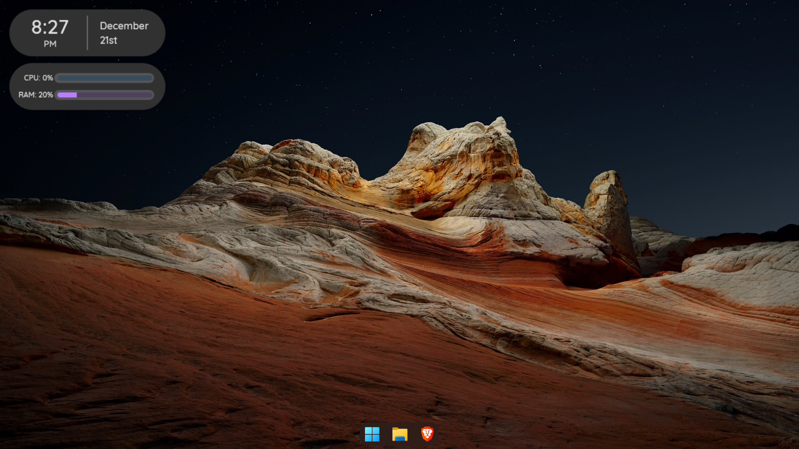
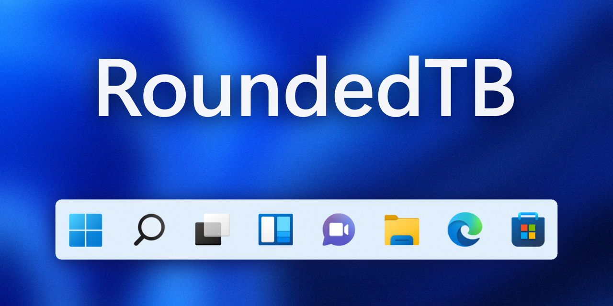
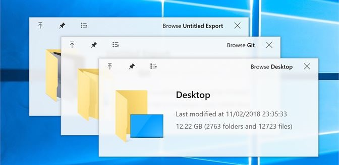
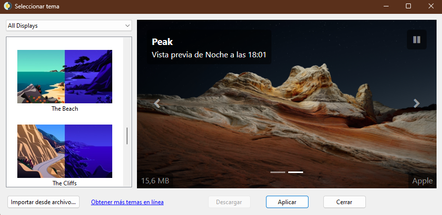
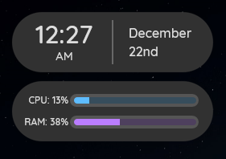

# Windows 11 

Mi personalizacion de windows   

# Tabla de contenidos
- [Actualizar Windows desde powershell](#actualizar-windows-desde-powershell)
- [Personalizacion windows](#personalizacion-de-windows)
    - [Rounded TB](#rounded-tb)
    - [Quick Look](#quicklook)
    - [WinDynamicDesktop](#windynamicdesktop)
- [Configuracion windows](#configuracion-de-windows)
    - [Microsoft PowerToys](#microsoft-powertoys)

# Actualizar Windows desde powershell
Podemos ver una lista de las actualizaciones pendientes
```pwershell
winget update
```
y podemos ejecutar el comando para actuallizar todas de una sola vex
```powershell
winger update --all
```

# Personalizacion de windows 
Algunas aplicaciones que podemos usar para mejorar la apariencia de windows 11

## Rounded TB 
Con rounded TB podremos personalizar la barra de tareas, se puede descargar en la Microsoft Store


## QuickLook
Quick Look es una función de vista previa en el explorador de archivos pulsando la barra espaciadora, se puede descargar en la Microsoft Store 


## WinDynamicDesktop
WinDynamicDesktop adapta la función de Escritorio dinámico y cambia el fondo de pantalla de su escritor en diversión de la hora del día, se puede descargar en la Microsoft Store


## Rainmeter
Podemos descargar **[Rainmeter](https://www.rainmeter.net/)** desde su pagina oficial, esta aplicacion nos permitara personalizar windows  

**[CyberPills](https://www.deviantart.com/cybergen49/art/CyberPills-Suite-for-Rainmeter-813857071)** nos permite añadir widget de hora y del estado de la CPU y de la RAM  



# Configuracion de windows 

## Microsoft PowerToys
es una colección de aplicaciones informáticas provistas por Microsoft para el sistema operativo, gracias a esta aplicacion tendremos algunas opciones adicionales como detectar el texto de una imagen, se puede descargar en la Microsoft Store